# 6D pose estimation full pipeline

## Random samples from each 6D prediction model
Samples reported are taken using ground truth bounding boxes

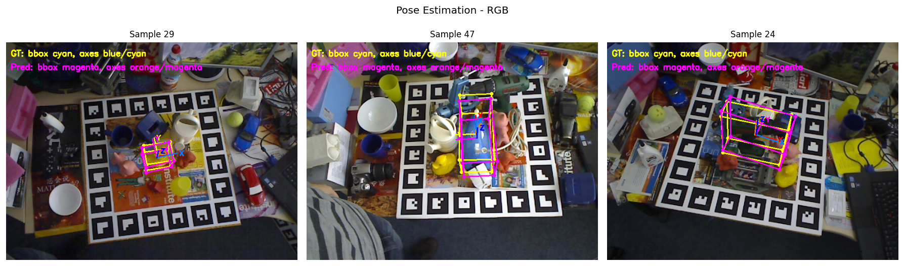   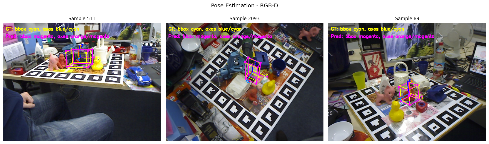   
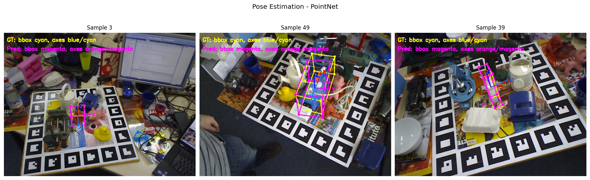   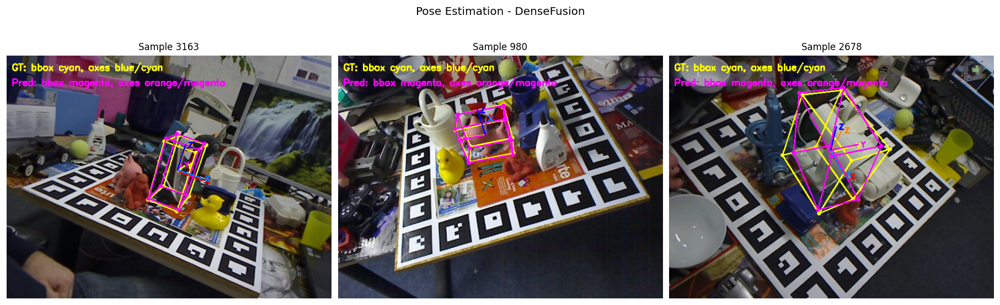

## Evaluation benchmarks
We first tested the ADD metric using GT bboxes to evaluate the accuracy of the 6D pose prediction models, then we tested again using YOLO bounding boxes and finally compared the results.

We used 0.1D \% ADD metric

### Using GT bboxes
 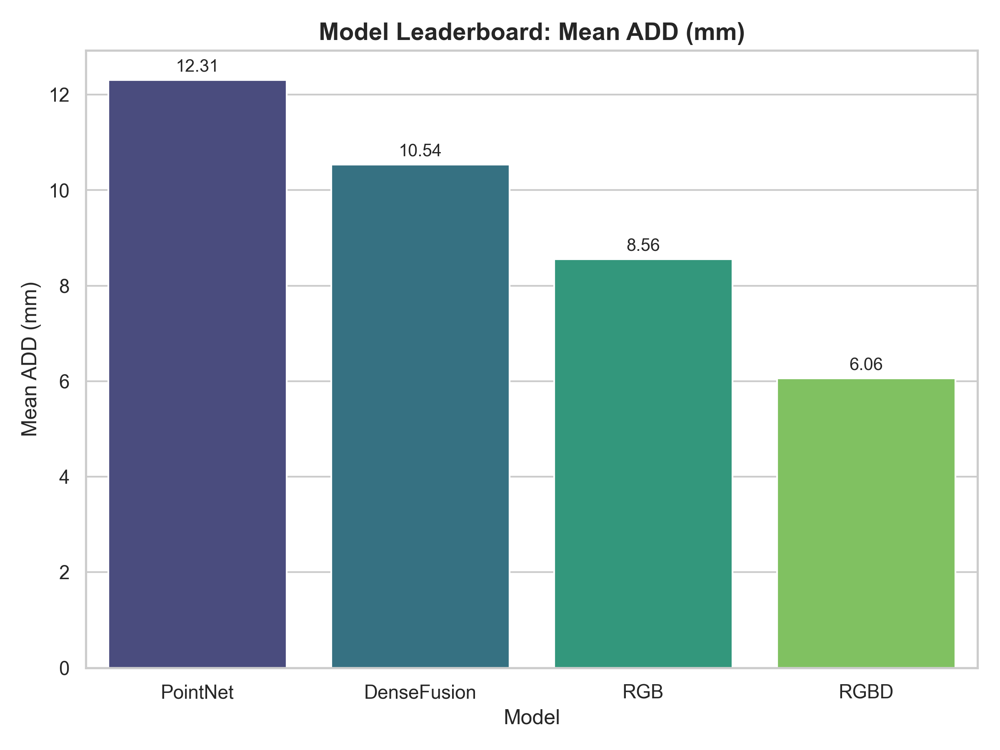   
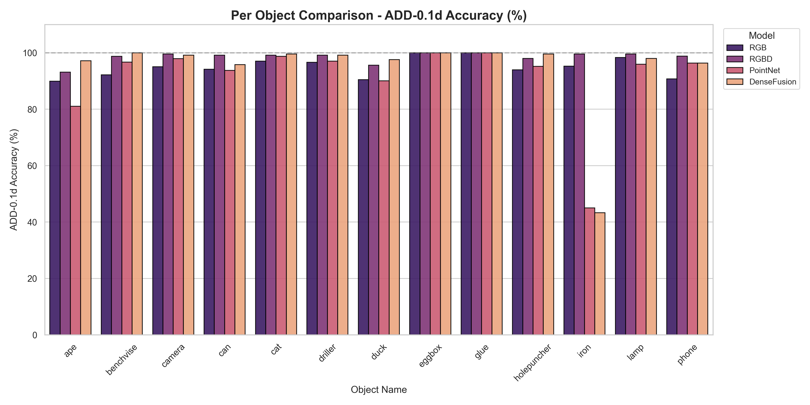 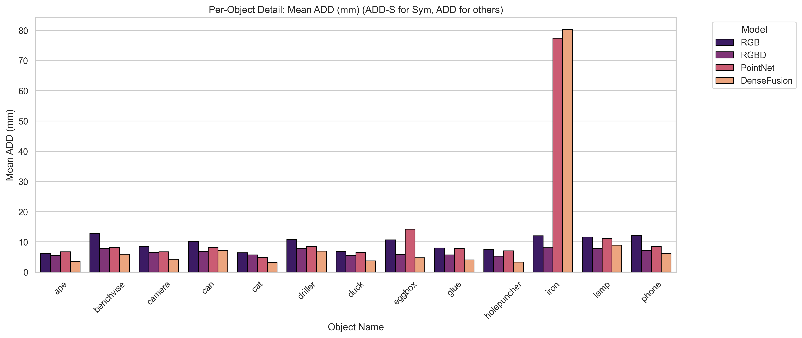

### Using YOLO bboxes
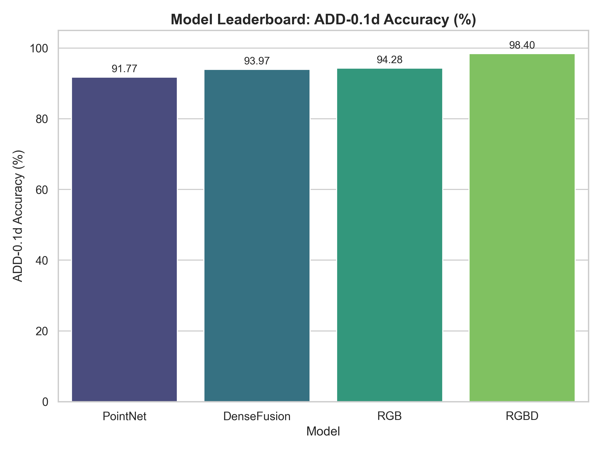 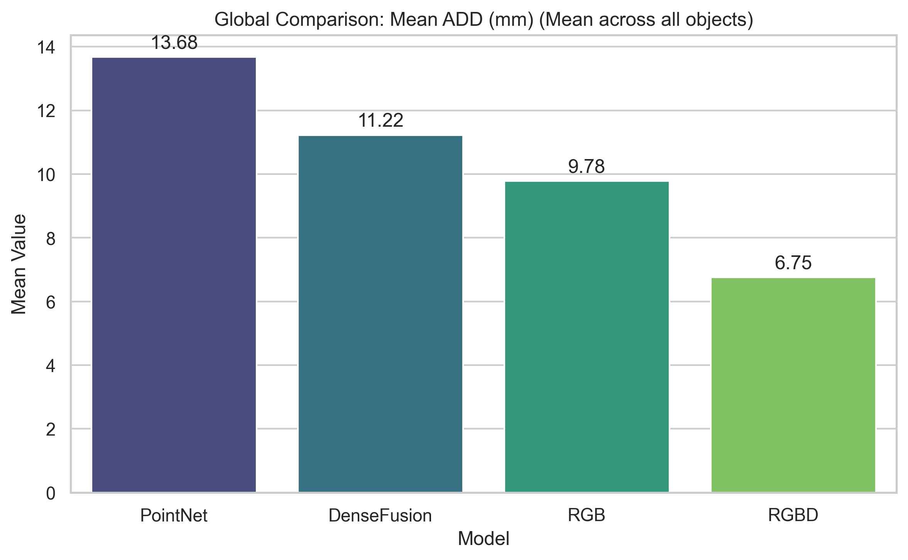   
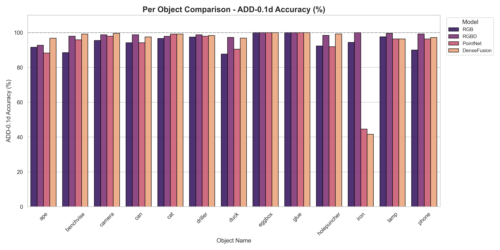 

### Comparison between GT and YOLO bounding boxes
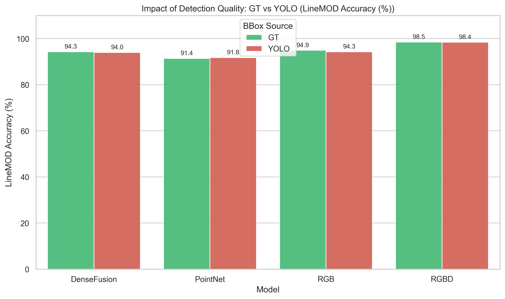 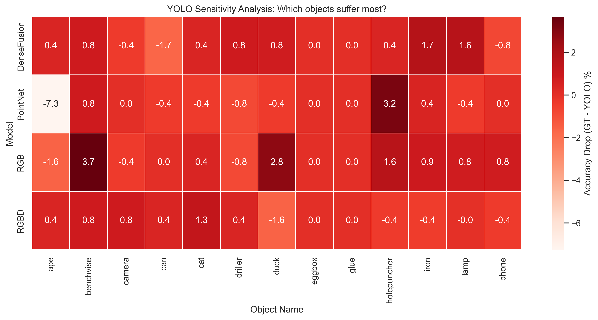