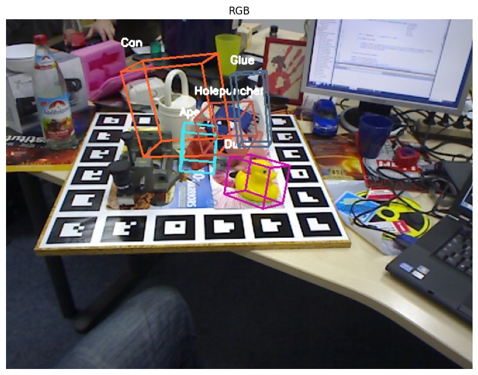
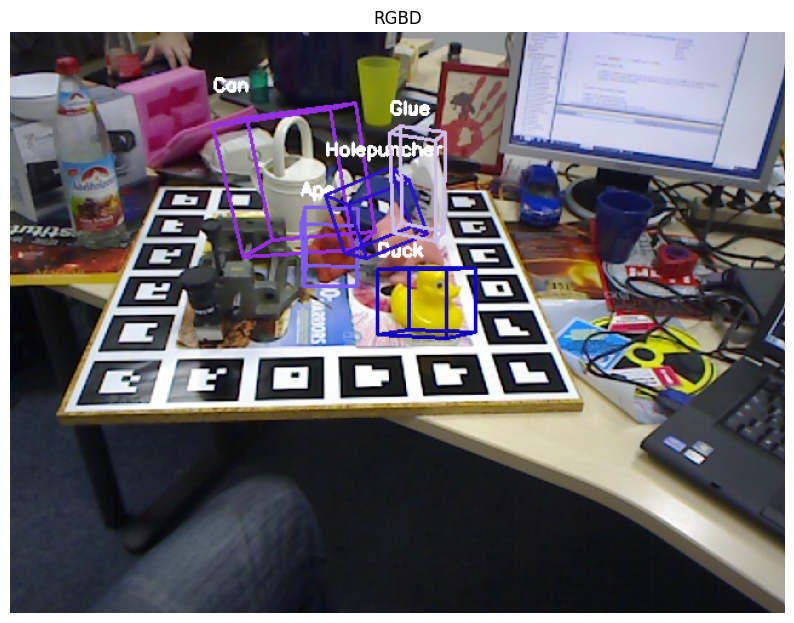
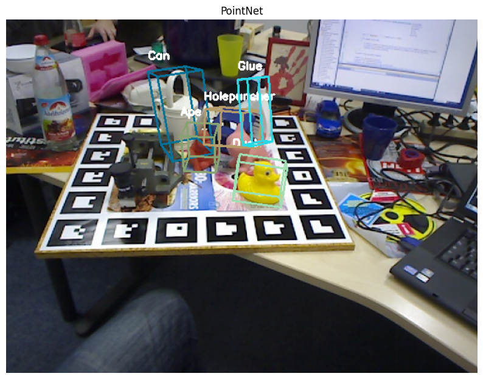
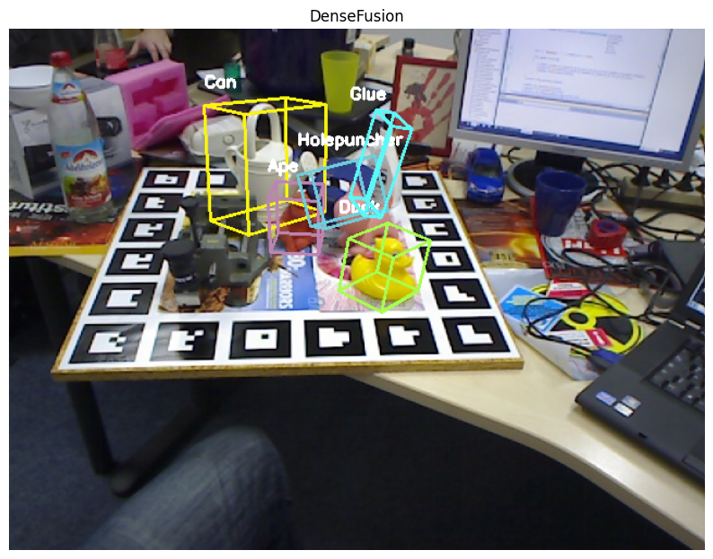

# 6D pose estimation full pipeline

## Performance Comparison with other models

Here we confront our approaches to other models proposed in the course of the years

| Method                       | Modality | Backbone / Architecture  | Accuracy (0.1d-ADD %) |
| :--------------------------- | :------: | :----------------------- | :-------------------: |
| **State of the Art (RGB)**   |          |                          |                       |
| PVNet (CVPR '19)             |   RGB    | ResNet-18 + Voting       |        86.30%         |
| CDPN (ICCV '19)              |   RGB    | ResNet-34                |        89.90%         |
| GDR-Net (CVPR '21)           |   RGB    | ResNet-34                |        93.70%         |
| ZebraPose (CVPR '22)         |   RGB    | Hierarchical Binary Code |      **98.00%**       |
|                              |          |                          |                       |
| **State of the Art (RGB-D)** |          |                          |                       |
| DenseFusion (CVPR '19)       |  RGB-D   | PointNet + CNN           |        94.30%         |
| PVN3D (CVPR '20)             |  RGB-D   | PointNet++               |        99.40%         |
| FFB6D (CVPR '21)             |  RGB-D   | Full Flow Bidirectional  |      **99.70%**       |
|                              |          |                          |                       |
| **Ours**                     |          |                          |                       |
| **RGB Model (baseline)**         |   RGB    | ResNet-50                |        93.01%         |
| **RGB-D Model**       |  RGB-D   | RGBD-ResNet-50           |      **98.21%**       |
| **PointNet**                 |  Depth   | PointNet                 |        89.74%         |
| **DenseFusion (Repro)**      |  RGB-D   | PointNet + CNN           |        93.81%         |

## Random samples from each 6D prediction model

Samples reported are taken using ground truth bounding boxes

     
   

## Evaluation benchmarks

We first tested the ADD metric using GT bboxes to evaluate the accuracy of the 6D pose prediction models, then we tested again using YOLO bounding boxes and finally compared the results.

We used 0.1D \% ADD metric

You can check the comparison steps [here](src/model_comparison.py).

You can check the evaluation steps [here](src/model_evaluation.py)

- Note: each one of the models has its own easy to use evaluation pipeline in `src/{model}/evaluation.py`, and can be seen in action at the end of training notebooks in `notebooks/{model}/{model}_training.ipynb`

### Using GT bboxes

   
 

### Using YOLO bboxes

   
 

### Comparison between GT and YOLO bounding boxes

 

## Full pipeline examples

In the full pipeline we don't have GTs anymore, so we perform pose estimation on each one of the detections provided by YOLO.

Since the pose model has only been trained to predict pose for one object per image, we do not expect exceptional results for all the objects' pose prediction, especially for those who are occluded.

You can find the notebook using all the pipelines for all the models [here](inference/full_inference.ipynb)

   
 
