# 6D Pose Estimation Pipeline


A modular two-stage pipeline for robust 6D object pose estimation in cluttered scenes, combining YOLOv11s detection with multiple pose regression approaches (RGB, RGB-D, PointNet, DenseFusion).

## Table of Contents
- [Performance Comparison](#performance-comparison-with-other-models)
- [Repository Structure](#repository-overview)
- [Quick Start](#quick-start)
- [Inference Examples](#inference-examples)
- [Evaluation Benchmarks](#evaluation-benchmarks)
- [Visual Results](#visual-results)
- [Pretrained Models](#pretrained-models)
- [Citation](#citation)

## Performance Comparison with other models

Numbers below match the paper (ADD-0.1d, full pipeline with YOLO detections on LineMOD Occluded).

| Method                       | Modality | Backbone / Architecture  | Accuracy (0.1d-ADD %) |
| :--------------------------- | :------: | :----------------------- | :-------------------: |
| **State of the Art (RGB)**   |          |                          |                       |
| PVNet (CVPR '19)             |   RGB    | ResNet-18 + Voting       |        86.30%         |
| CDPN (ICCV '19)              |   RGB    | ResNet-34                |        89.90%         |
| GDR-Net (CVPR '21)           |   RGB    | ResNet-34                |        93.70%         |
| ZebraPose (CVPR '22)         |   RGB    | Hierarchical Binary Code |      **98.00%**       |
|                              |          |                          |                       |
| **State of the Art (RGB-D)** |          |                          |                       |
| DenseFusion (CVPR '19)       |  RGB-D   | PointNet + CNN           |        94.30%         |
| PVN3D (CVPR '20)             |  RGB-D   | PointNet++               |        99.40%         |
| FFB6D (CVPR '21)             |  RGB-D   | Full Flow Bidirectional  |      **99.70%**       |
|                              |          |                          |                       |
| **Ours (full pipeline)**     |          |                          |                       |
| **RGB Model (baseline)**     |   RGB    | ResNet-50                |        94.28%         |
| **RGB-D Model**              |  RGB-D   | RGBD-ResNet-50           |      **98.40%**       |
| **PointNet**                 |  Depth   | PointNet                 |        91.77%         |
| **DenseFusion**              |  RGB-D   | PointNet + CNN           |        93.97%         |

### Repository overview
- Data: LineMOD splits are under [Linemod_preprocessed](Linemod_preprocessed), [Linemod_preprocessed_small](Linemod_preprocessed_small), and [Linemod_preprocessed_smaller](Linemod_preprocessed_smaller); YOLO detections are in [YOLO_outputs](YOLO_outputs).
- Training and reports: notebooks for each model live in [notebooks](notebooks) (e.g. [notebooks/pose_rgb/pose_rbg_training.ipynb](notebooks/pose_rgb/pose_rbg_training.ipynb), [notebooks/pose_rgbd/pose_rgbd_training.ipynb](notebooks/pose_rgbd/pose_rgbd_training.ipynb), [notebooks/pose_pointnet/pose_pointnet_training.ipynb](notebooks/pose_pointnet/pose_pointnet_training.ipynb), [notebooks/dense_fusion/pose_dense_fusion_training.ipynb](notebooks/dense_fusion/pose_dense_fusion_training.ipynb), [notebooks/yolo/yolo_training.ipynb](notebooks/yolo/yolo_training.ipynb)).
- Source: model code and evaluation helpers are under [src](src); each model has its own module, e.g. [src/pose_rgb](src/pose_rgb), [src/pose_rgbd](src/pose_rgbd), [src/pose_pointnet](src/pose_pointnet), [src/dense_fusion](src/dense_fusion), [src/detection](src/detection), and shared utilities sit in [utils](utils).
- Evaluation: aggregated comparison logic is in [src/model_comparison.py](src/model_comparison.py) and [src/model_evaluation.py](src/model_evaluation.py); per-model evaluators are in the corresponding subfolders (for example [src/pose_rgb/evaluate.py](src/pose_rgb/evaluate.py), [src/pose_rgbd/evaluate.py](src/pose_rgbd/evaluate.py), [src/pose_pointnet/evaluate.py](src/pose_pointnet/evaluate.py), [src/dense_fusion/evaluate.py](src/dense_fusion/evaluate.py)).
- Inference: the full end-to-end demo notebook lives in [inference/full_inference.ipynb](inference/full_inference.ipynb); script-based inference utilities are in [src/inference](src/inference).
- Metrics: ADD implementation is in [metrics/ADD_metric.py](metrics/ADD_metric.py).

## Quick Start

### Requirements
- Python 3.12+ recommended
- PyTorch with CUDA support (for GPU acceleration)
- 8GB+ GPU memory recommended for training; inference works with less

### Installation
```bash
pip install -r requirements.txt
```

### Download Data & Models
1. LineMOD dataset splits are included under [Linemod_preprocessed](Linemod_preprocessed)
2. Download pretrained checkpoints from [Google Drive](https://drive.google.com/drive/folders/1O66RK9Xn2vPpWJJM2KMj80c2-jbza6TO?usp=sharing)
3. Place checkpoints in the appropriate directories:
   - YOLO: `notebooks/yolo/yolo11s_autolabel_final_with_80_th/weights/best.pt`
   - RGB-D: `notebooks/pose_rgbd/RGBD_final/rgbd_rotation_model.pth`
   - RGB: `notebooks/pose_rgb/RGB_run/` (rotation + translation models)
   - PointNet: `notebooks/pose_pointnet/PointNet_final/pose_model.pth`
   - DenseFusion: `notebooks/dense_fusion/dense_final/fusion_pose_model.pth`

### Run Demo
For a complete end-to-end demonstration:
```bash
jupyter notebook inference/full_inference.ipynb
```

## Inference Examples

### Scripted inference pipeline
- Pick the pipeline matching your modality: `RGBPoseInferencePipeline`, `RGBDPoseInferencePipeline`, `PointNetInferencePipeline`, or `DenseFusionInferencePipeline` from [src/inference/inference_pipeline.py](src/inference/inference_pipeline.py).
- Inputs: a sample folder containing `rgb.png` (and `depth.png` for RGB-D/PointNet/DenseFusion) plus the intrinsic matrix `cam_K` (e.g., from Linemod). See [inference/sample](inference/sample) for structure.
- Place the YOLO detector checkpoint and the pose checkpoint paths in the constructor, and point `models_path` to the Linemod models folder (e.g., [Linemod_preprocessed/models](Linemod_preprocessed/models)).

Example (RGB-D pipeline):

```python
from pathlib import Path
import numpy as np
import cv2
from src.inference.inference_pipeline import RGBDPoseInferencePipeline

# Load camera intrinsics
cam_K = np.load('inference/sample/cam_K.npy')

# Initialize pipeline
pipeline = RGBDPoseInferencePipeline(
    yolo_path='notebooks/yolo/yolo11s_autolabel_final_with_80_th/weights/best.pt',
    pose_model_path='notebooks/pose_rgbd/RGBD_final/rgbd_rotation_model.pth',
    models_path=Path('Linemod_preprocessed/models'),
    device='cuda',
    conf_threshold=0.5
)

# Run inference
detections, vis_img = pipeline.run('inference/sample', cam_K)

# Save or display results
cv2.imwrite('output.png', vis_img)
print(f"Detected {len(detections)} objects")
for det in detections:
    print(f"  - {det['class_id']}: conf={det['conf']:.2f}")
```

Other available pipelines: `RGBPoseInferencePipeline`, `PointNetInferencePipeline`, `DenseFusionInferencePipeline`.

## Evaluation Benchmarks

Samples reported are taken using ground truth bounding boxes

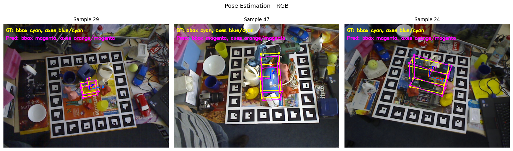 <br/> 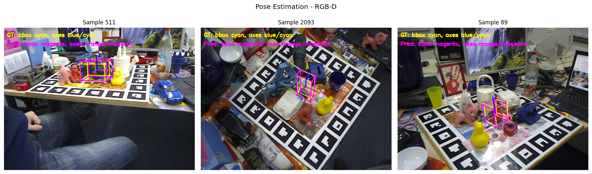 <br/>
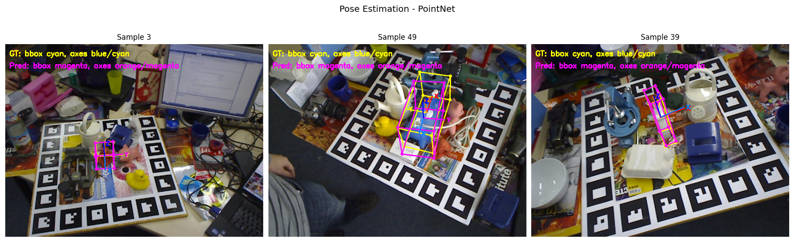 <br/> 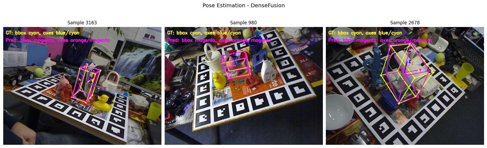

We evaluate pose accuracy using the ADD-0.1d metric, first with ground truth bounding boxes, then with YOLO detections, and finally compare the impact of detection quality.

### Object Detection (YOLOv11s)
- **mAP@50** (masked evaluation, LineMOD Occluded): **0.999**
- **Per-class AP**: 1.000 on 12/13 classes, 0.993 on holepuncher (Table 1 in paper)

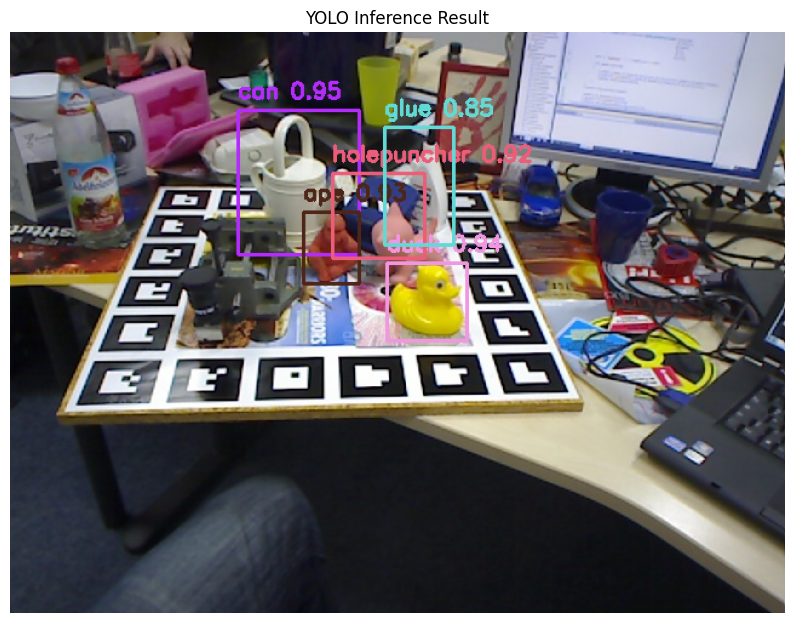

### 6D Pose Estimation Results

You can check the comparison steps [here](src/model_comparison.py).

You can check the evaluation steps [here](src/model_evaluation.py)

- Note: each model ships with an evaluation pipeline in its folder (see the examples above such as [src/pose_rgb/evaluate.py](src/pose_rgb/evaluate.py)), and the flow is demonstrated at the end of the corresponding training notebooks (for example [notebooks/pose_rgb/pose_rbg_training.ipynb](notebooks/pose_rgb/pose_rbg_training.ipynb)).

### Using GT bboxes

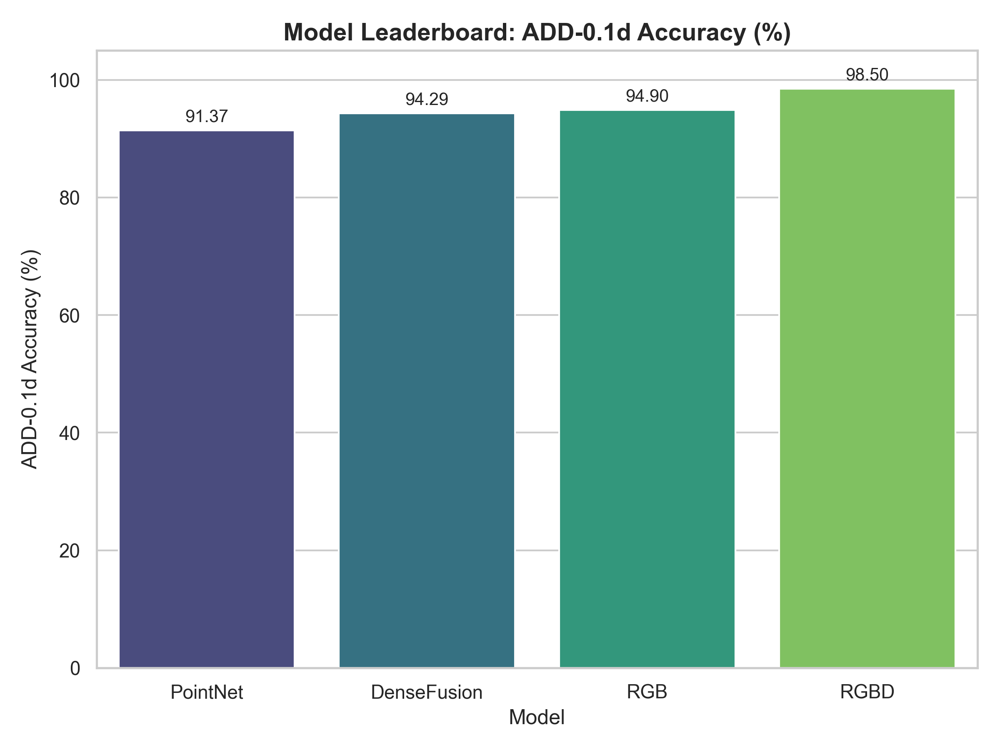 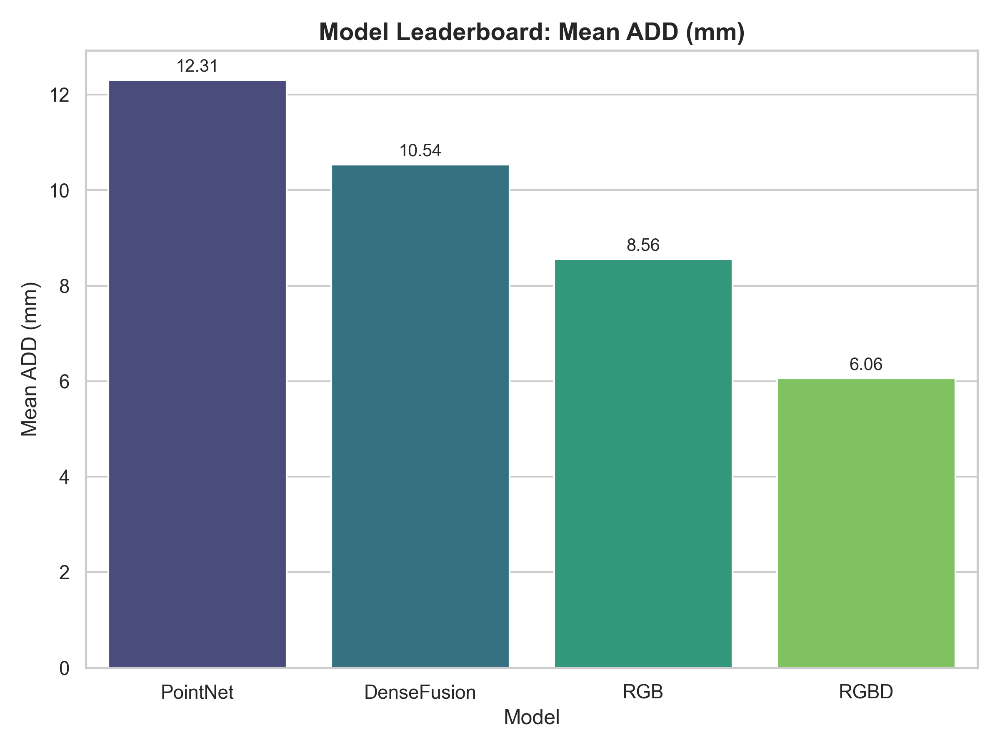 <br/>
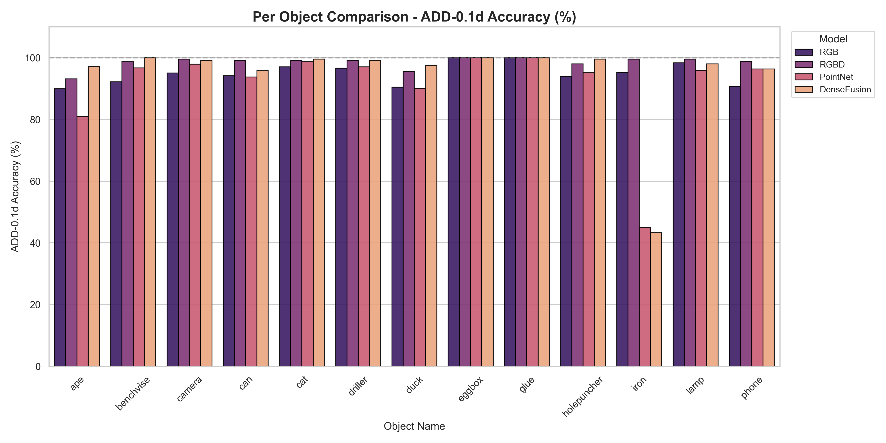 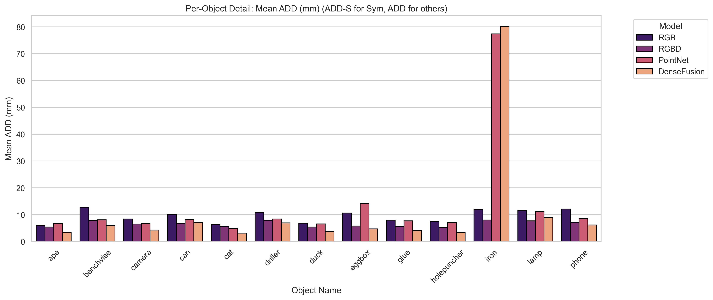

### Using YOLO bboxes

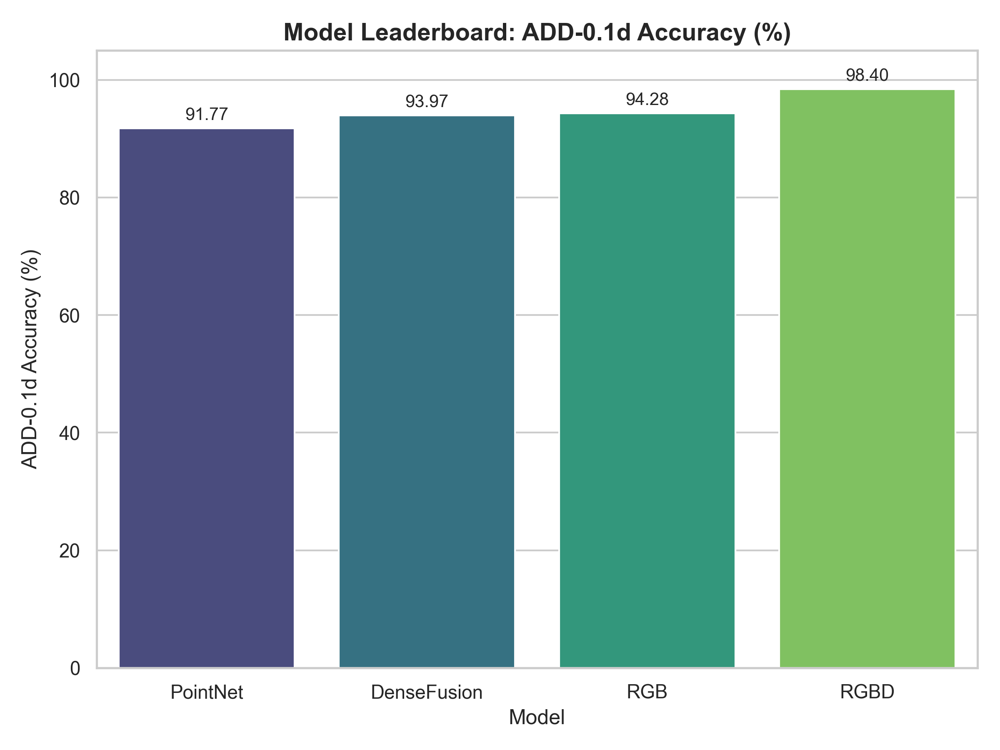 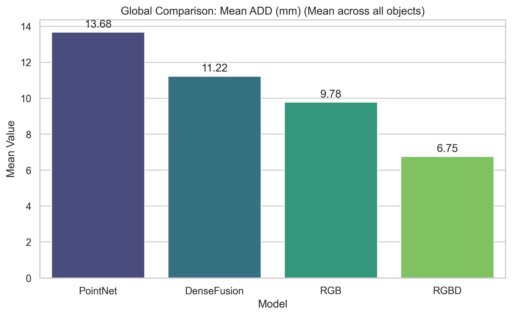 <br/>
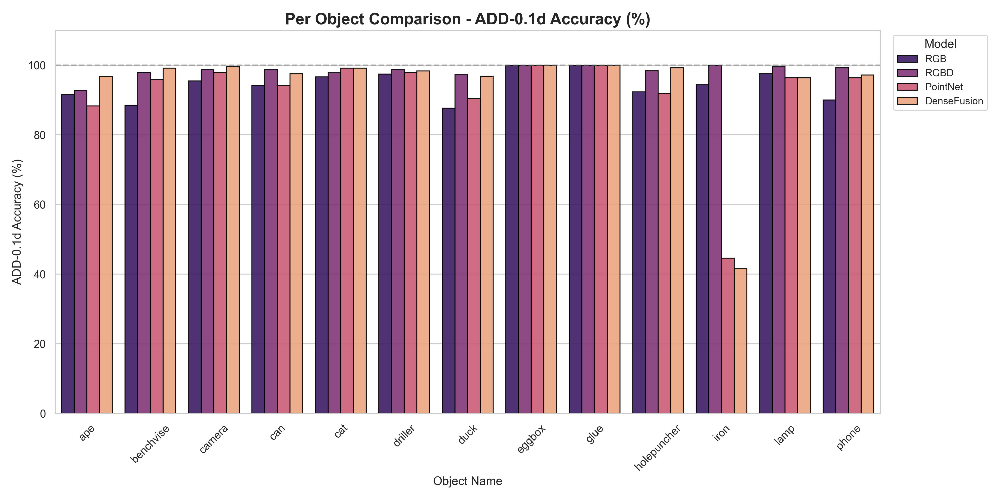 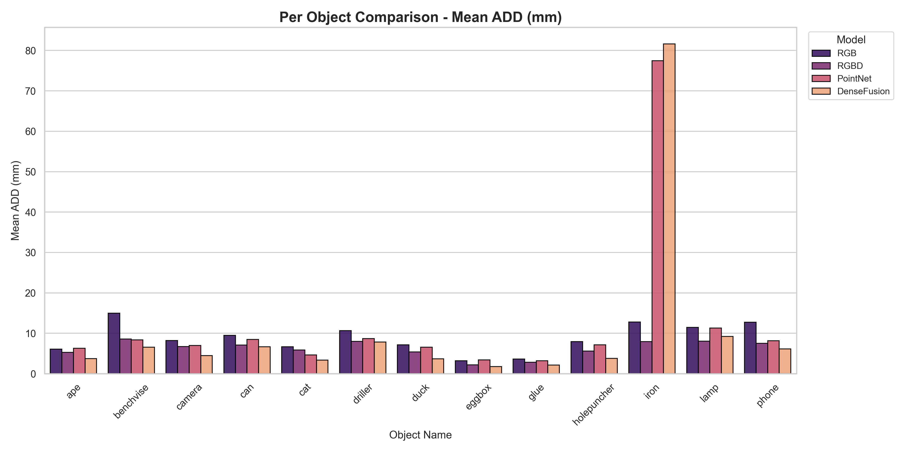

### Comparison between GT and YOLO bounding boxes

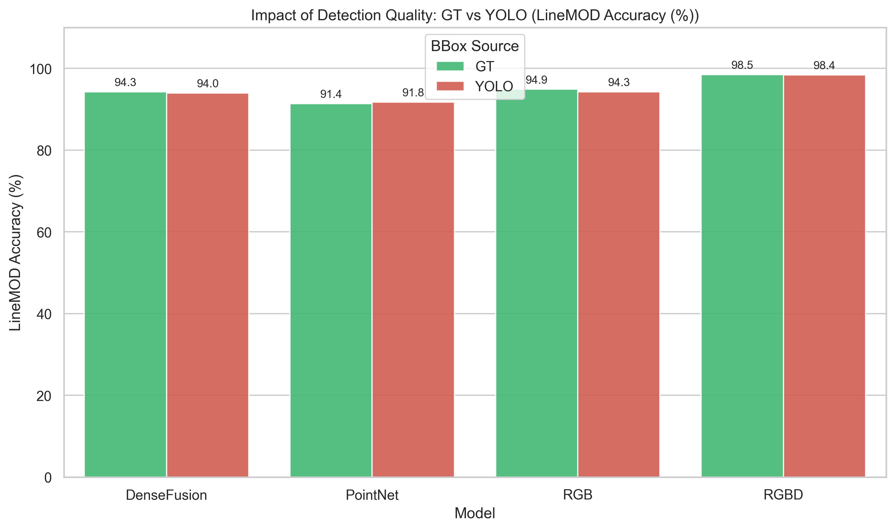 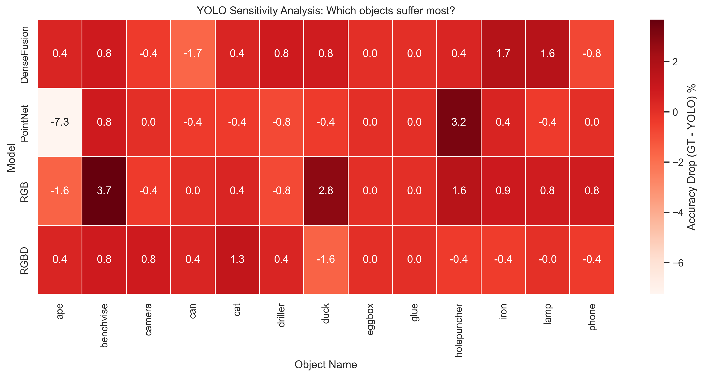

## Visual Results

### Full Pipeline Examples

End-to-end results combining YOLO detection with pose estimation (no ground truth bounding boxes).

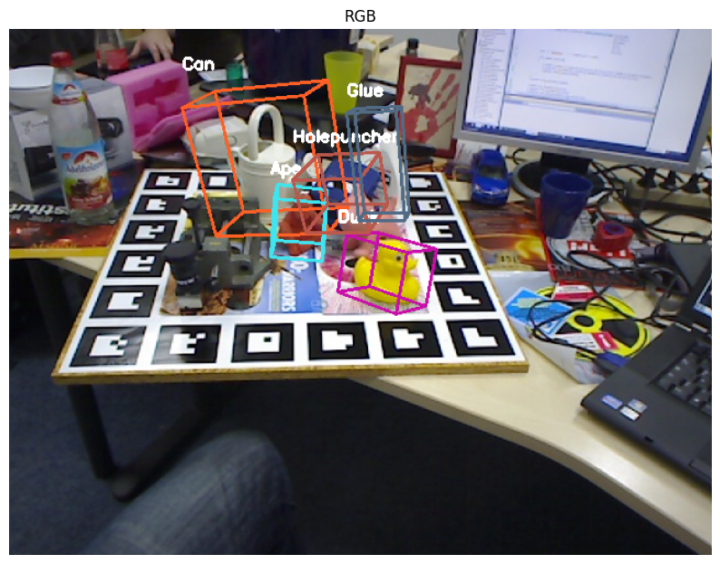 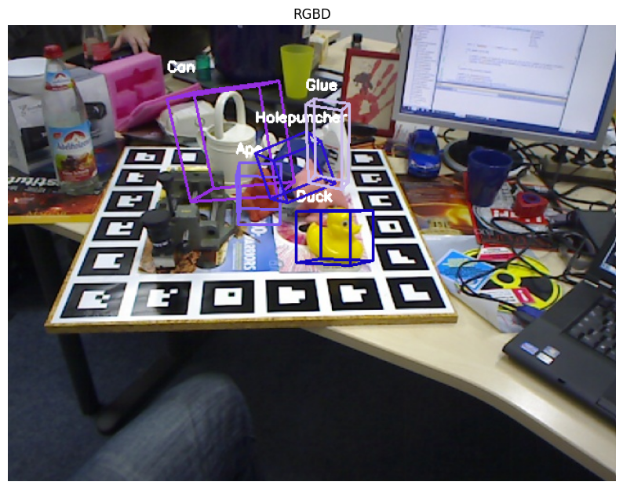 <br/>
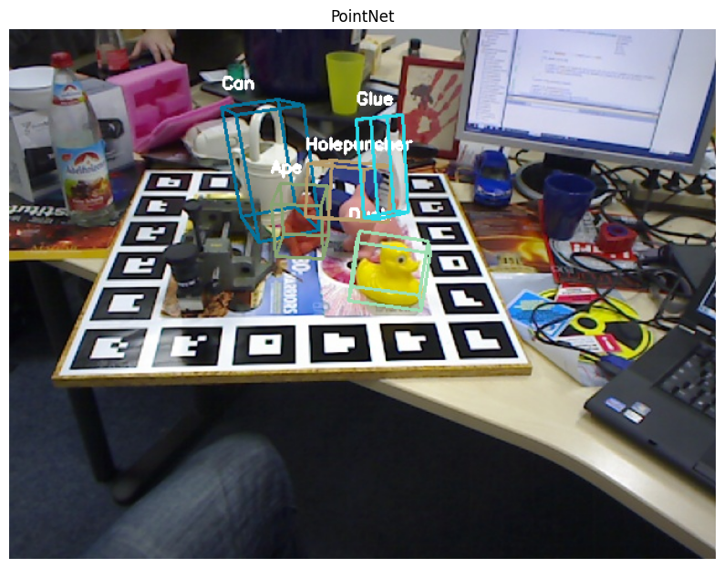 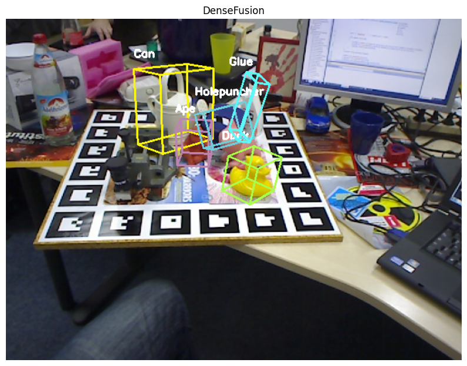

### Sample Predictions (GT bboxes)

Pose estimation results using ground truth bounding boxes:

 <br/>  <br/>
 <br/> 

## Pretrained Models

All trained checkpoints are available on [Google Drive](https://drive.google.com/drive/folders/1O66RK9Xn2vPpWJJM2KMj80c2-jbza6TO?usp=sharing).

**Checkpoint sizes:**
- YOLO detector: ~45 MB
- RGB-D model: ~280 MB
- RGB models (rot + trans): ~280 MB total
- PointNet: ~8 MB
- DenseFusion: ~130 MB

See [Quick Start](#quick-start) for placement instructions.

## Citation

If you use this work in your research, please cite:

```bibtex
@article{carollo2024robust6dpose,
  title={Robust 6D Object Pose Estimation in Cluttered Scenes via Object-Aware Geometric Learning},
  author={Carollo, Federico and Benvenuti, Alessandro and Borrelli, Francesco and Scala, Tobias},
  journal={Advanced Machine Learning Course Project},
  year={2024},
  institution={Politecnico di Torino}
}
```

---

**Project Members:** Federico Carollo, Alessandro Benvenuti, Francesco Borrelli, Tobias Scala
**Institution:** Politecnico di Torino  
**Course:** Advanced Machine Learning
